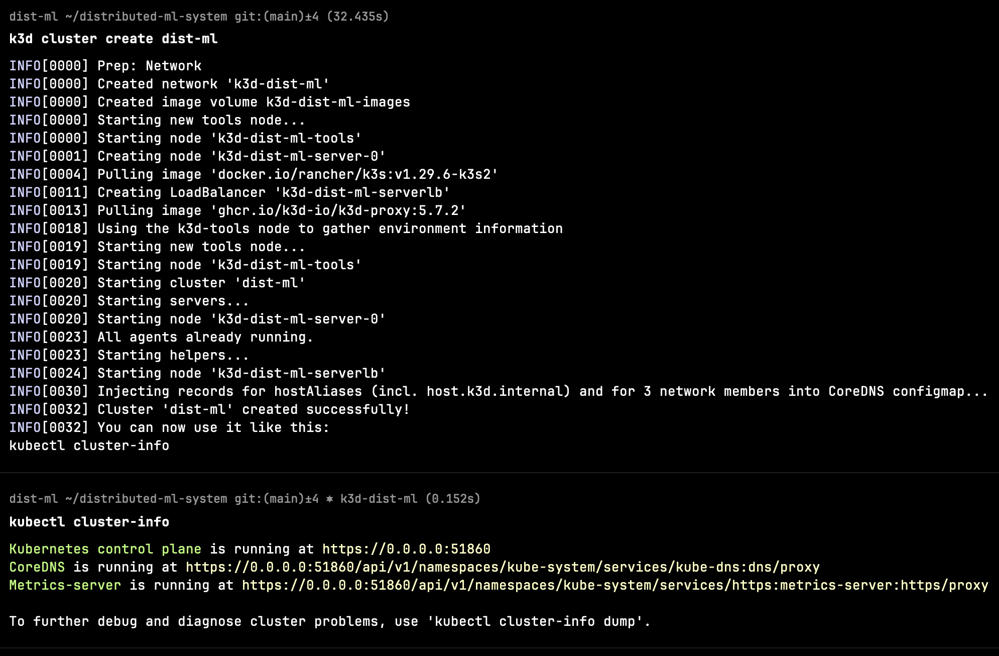
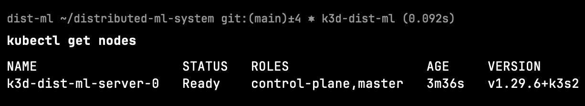
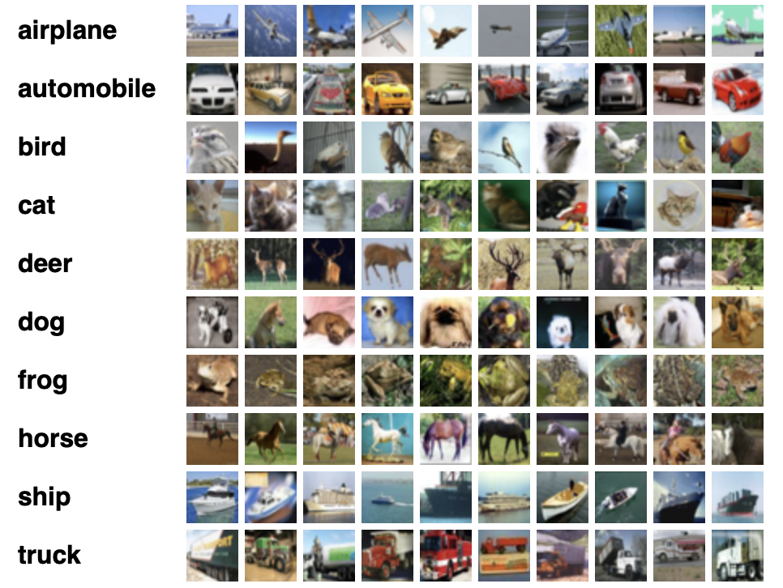
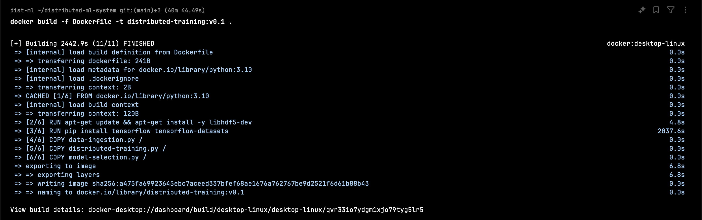
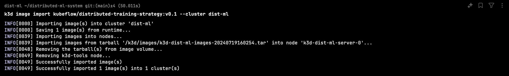

# Distributed Machine Learning System


Building a distributed machine learning system in this modern era of deep learning is necessary. Every company that uses machine learning wants to serve their customers at scale. Models are becoming huge and the datasets required to train these models are also increasing. This trend will continue in future as well because of the [scaling laws](https://arxiv.org/abs/2203.15556). On top of that GPUs are very expensive. So keeping these GPUs idle can cost you a lot. Using multi-GPU training and optimizing inference can save costs and improve user experience.

I'm working on this project to get a deeper understanding of distributed machine learning systems. I'm using Kubernetes, Kubeflow, Tensorflow and Argo.


- [Distributed Machine Learning System](#distributed-machine-learning-system)
  - [Background](#background)
  - [Setup](#setup)
  - [System Architecture](#system-architecture)
  - [Data Ingestion](#data-ingestion)
    - [Create a simple pipeline](#create-a-simple-pipeline)
    - [Create a distributed data pipeline](#create-a-distributed-data-pipeline)
      - [What happens actually under the hood when this strategy is used?](#what-happens-actually-under-the-hood-when-this-strategy-is-used)
  - [Create a simple neural net](#create-a-simple-neural-net)
    - [Create a distributed model training workflow](#create-a-distributed-model-training-workflow)
  - [Model saving](#model-saving)
  - [Containerization](#containerization)
  - [Persistent volume](#persistent-volume)
  - [TFJob](#tfjob)
  - [Model selection](#model-selection)
  - [Inference](#inference)
    - [Create a single server model inference service](#create-a-single-server-model-inference-service)
    - [Distributed model inference](#distributed-model-inference)
  - [Replicated model servers inference](#replicated-model-servers-inference)
  - [End-to-end Workflow](#end-to-end-workflow)
  - [Logger](#logger)
  - [Monitoring](#monitoring)
  - [Summary](#summary)
  - [Next Steps](#next-steps)
  - [References](#references)


## Background

> Distributed systems are a group of nodes that talk to each other to achieve a specific task, such as streaming movies across devices, search engines, etc. - Understanding distributed systems

These systems handle massive amounts of data across multiple clusters, use automation tools, and benefit from hardware accelerations.

This repository includes code and references to implement a scalable and reliable machine learning system. I'm constructing all the components including data ingestion, training, serving, and monitoring these workloads.

I'm building an image classification end-to-end system.

The steps involved are:
1. Setup
2. Data Ingestion
3. Distributed Training
4. Evaluation
5. Serving
6. End-to-End Workflow


## Setup

I'm using a Macbook. These system are generally built on cloud. I'm using conda as the package manager. I also use homebrew for installations.

[1] Let's install pytorch for data processing, model building and evaluation workflows.

```bash
conda install tensorflow tensorflow_datasets
```


[2] `Docker` is required to create single- or multi-node clusters. I'm installing docker desktop.

[3] Install a popular CLI utility called `kubectl`.

```bash
brew install kubectl
```

[4] To use Kubernetes on the local machine, install k3d, a lightweight wrapper to run k8s. There's minikube, kind and other distributions as well but I find k3d lean, memory efficient and simpler.

```bash
wget -q -O - https://raw.githubusercontent.com/rancher/k3d/main/install.sh | bash
```

Create a single-node cluster. You can create a multi-server cluster as well by specifying `--servers 3`.

```bash
k3d cluster create dist-ml --image rancher/k3s:v1.25.3-k3s1
```

You can see the cluster info using command

```bash
kubectl cluster-info
```



Let's see which pods are created using

```bash
kubectl get nodes
```



[5] Install `kubectx` to easily switch between clusters and `kubens` for namespaces. This is a very handy utility.

```bash
brew install kubectx
```

Using kubens you can swtich between namespaces easily

[6] Next, we install kubeflow training operator that allows us to train large models effectively.

But first create a new namespace.

```bash
kubectl create namespace kubeflow

kubens kubeflow
```

Now install the operator.

```bash
kubectl apply -k "github.com/kubeflow/training-operator.git/manifests/overlays/standalone?ref=v1.7.0"
```

[7] To create an end-to-end workflow we need argo workflows.

```bash
kubectl create namespace argo
kubectl apply -n argo -f https://github.com/argoproj/argo-workflows/releases/download/v3.5.8/install.yaml
```

[8] For experiment tracking, install MLFlow.

```bash
helm install dist-mlflow community-charts/mlflow
```

## System Architecture

There are multiple design patterns which can be used to create a ML system. In this project, I'm sticking to the easiest one. It has a data ingestion component. Once data is available you can schedule the pipeline to download the data and store it somewhere(e.g. s3). We then train multiple models on the same dataset parallely. Once the models are available, we can pick the best model and create a scalable inference service.


## Data Ingestion

I'm using the cifar10 dataset that has 60,000 images(50,000 for training and 10,000 for testing). It has 10 different catergories and each is a low resolution color image of 32x32 px.



### Create a simple pipeline

The `tf.data` API enables you to build complex input pipelines from simple, reusable pieces. It's very efficient and enables handling large amounts of data, reading from different data formats, and performing complex transformations.

I'm loading the dataset into a `tf.data.Dataset` object and cast the images to float32. Next, I'm normalizing the image pixel values from the [0, 255] to the [0, 1] range. These are some standard practices. I'm keeping an *in-memory cache* to improve performance. Let's also shuffle the training data to add some randomness.

```python
import Tensorflow_datasets as tfds
import Tensorflow as tf

def get_dataset():
    BUFFER_SIZE = 10000
    def scale(image, label):
        image = tf.cast(image, tf.float32)
        image /= 255
        return image, label
    datasets, info = tfds.load(name='mnist', with_info=True, as_supervised=True)
    train = datasets['train']
    return train.map(scale).cache().shuffle(BUFFER_SIZE)
```

I'm using Tensorflow datasets module to load the dataset. The above piece of code gives a shuffled dataset where each element consists of images and labels.

### Create a distributed data pipeline

To consume a large dataset(>PBs), we need to use a distributed approach. We can do that with some tweaks to the same function that we created.

For distributed data ingestion, just increase the batch size to use the extra computing power effectively,

> [!TIP]
> Use the largest batch size that fits the GPU memory

There are several strategies in-built into Tensorflow library. There is a `MirroredStrategy()` that can be used to train on a single machine with multiple GPUs but if you want to distribute training on multiple machines in a cluster/s(recommended and my goal), then `MultiWorkerMirroredStrategy()` strategy is a way to go.

```python
strategy = tf.distribute.MultiWorkerMirroredStrategy()

BATCH_SIZE_PER_REPLICA = 64
BATCH_SIZE = BATCH_SIZE_PER_REPLICA * strategy.num_replicas_in_sync
```

The `num_replicas_in_sync` equals the number of devices that are used in the **all-reduce** operation. Use the `tf.distribute.MultiWorkerMirroredStrategy` API and with the help of this strategy, a keras model that was designed to run on a single worker can seamlessly work on multiple workers with minimal code changes.

#### What happens actually under the hood when this strategy is used?

1. Each GPU performs the forward pass on a different slice of the input data and computes the loss

2. Next each GPU compute the gradients based on the loss

3. These gradients are then aggregated across all of the devices(using an all-reduce algorithm)

4. The optimizer updates the weights using the reduced gradients thereby keeping the devices in sync

> [!NOTE]
> PyTorch has [DDP](https://pytorch.org/docs/stable/generated/torch.nn.parallel.DistributedDataParallel.html) and [FSDP](https://pytorch.org/docs/stable/fsdp.html)(more popular and useful)

I'm enabling automatic data sharding across workers by setting `tf.data.experimental.AutoShardPolicy` to `AutoShardPolicy.DATA`. This setting is needed to ensure convergence and performance. The concept of [sharding](https://www.Tensorflow.org/api_docs/python/tf/data/experimental/DistributeOptions) means handing each worker a subset of the entire dataset.

Now the final training workflow can be written below

```python
with strategy.scope():
    dataset = get_dataset().batch(BATCH_SIZE).repeat()
    options = tf.data.Options()
    options.experimental_distribute.auto_shard_policy = tf.data.experimental.AutoShardPolicy.DATA
    dataset = dataset.with_options(options)
    model = build_and_compile_cnn_model()

model.fit(dataset, epochs=5, steps_per_epoch=70)
```

## Create a simple neural net

A simple neural net with `Adam` optimizer and `SparseCategoricalCrossentropy` loss as we have 10 categories to predict from.

```python
def build_and_compile_cnn_model():
    """
    Build and compile a simple cnn model
    """
    print("Training a simple cnn model")
    model = tf.keras.models.Sequential()
    model.add(tf.keras.layers.Input(shape=(28, 28, 1), name="image_bytes"))
    model.add(tf.keras.layers.Conv2D(32, (3, 3), activation="relu"))
    model.add(tf.keras.layers.MaxPooling2D((2, 2)))
    model.add(tf.keras.layers.Flatten())
    model.add(tf.keras.layers.Dense(64, activation="relu"))
    model.add(tf.keras.layers.Dense(10, activation="softmax"))

    model.summary()

    model.compile(
        optimizer="adam", loss="sparse_categorical_crossentropy", metrics=["accuracy"]
    )

    return model
```

Let's define some necessary callbacks that will be executed during model training.

1. Checkpointing saves model weights at some frequency(use `save_freq`). We use `tf.keras.callbacks.ModelCheckpoint` for checkpointing.

```python
checkpoint_dir = './training_checkpoints'
checkpoint_prefix = os.path.join(checkpoint_dir, "ckpt_{epoch}")
```

I define the checkpoint directory to store the checkpoints and the names of the files. Checkpoints are important to restore the weights if the model training stops due to some issues.

2. `tf.keras.callbacks.TensorBoard` writes a log for TensorBoard, which allows you to visualize the graphs.

3. `tf.keras.callbacks.LearningRateScheduler` schedules the learning rate to change after, for example, every epoch/batch.

```python
def decay(epoch):
    if epoch < 3:
        return 1e-3
    elif epoch >= 3 and epoch < 7:
        return 1e-4
    else:
        return 1e-5
```

4. PrintLR prints the learning rate at the end of each epoch.

```python
class PrintLR(tf.keras.callbacks.Callback):
    def on_epoch_end(self, epoch, logs=None):
        print('\nLearning rate for epoch {} is {}'.format(        epoch + 1, model.optimizer.lr.numpy()))
```

Now put all the components together.

```python
callbacks = [
    tf.keras.callbacks.TensorBoard(log_dir='./logs'),
    tf.keras.callbacks.ModelCheckpoint(filepath=checkpoint_prefix, save_weights_only=True),
    tf.keras.callbacks.LearningRateScheduler(decay),
    PrintLR()
]
```

Now every piece is in it's correct place.

Next, train the model.

```python
model = build_and_compile_cnn_model()
model.fit(dataset, epochs=3, steps_per_epoch=70, callbacks=callbacks)
```

I'm getting an accuracy of 94% on the training data. I'm not spending much time on increasing the accuracy as it's not our end goal.

> [!NOTE]
> I'm doing these experiments in a colab notebook. Later I will copy this code to python scripts.

### Create a distributed model training workflow

I've already discussed about the strategy to use here. Just a recap - for distributed training on multiple workers, use the `MultiWorkerMirroredStrategy` with Keras(tf as backend).

There are different ways to do distributed training and `data parallelism` is the most common one. There are two common ways to do [distributed training with data parallelism](https://www.Tensorflow.org/tutorials/distribute/multi_worker_with_keras):

1. *Synchronous* training, where the steps of training are synced across the workers and replicas. all workers train over different slices of input data in sync, and aggregating gradients at each step.

2. *Asynchronous* training, where the training steps are not strictly synced. all workers are independently training over the input data and updating variables asynchronously. see [parameter server training](https://www.Tensorflow.org/tutorials/distribute/parameter_server_training).

I'm using the `MultiWorkerMirroredStrategy` that does synchronous distributed training across multiple workers, each with potentially multiple GPUs. It replicates all variables and computations to each local device and uses distributed collective implementation (e.g. all-reduce) so that multiple workers can work together.

Let's initiate the distributed input data pipeline and the model inside the strategy scope but hold on we need to save these models somewhere so that they can then be fetched for inference.

## Model saving

To save the model we can use `model.save` but since there are multiple models training parallely, the saving destinations need to be different for each worker.

One approach is:
- For worker nodes, save the model to a temporary directory
- For the master node, save the model to the provided directory

The temporary directories of the workers need to be unique to prevent errors. The model saved in the directories will be identical, and only the model saved by the master should be referenced for restoring or serving.

I'm not saving the model to temporary directories as doing this will waste my laptop's computing resources and memory. I'm determining which worker node is the master and saving its model only.

To determine if the worker node is the master or not, use the environment variable `TF_CONFIG`.

An example configuration looks like below:
```python
tf_config = {
    'cluster': {
        'worker': ['localhost:12345', 'localhost:23456']
    },
    'task': {'type': 'worker', 'index': 0}
}
```

The `_is_worker_master` function inspects the cluster specs and current task type and returns `True` if the worker is the master and `False` otherwise.

```python
def _is_worker_master():
    return TASK_INDEX == 0

tf_config = json.loads(os.environ.get('TF_CONFIG') or '{}')
TASK_INDEX = tf_config['task']['index']

if _is_worker_master():
    model_path = args.saved_model_dir
else:
    model_path = args.saved_model_dir + '/worker_tmp_' + str(TASK_INDEX)

multi_worker_model.save(model_path)
```


## Containerization

To containerize I have a Python script called `distributed-training.py` that has all the three models.

Let's create a `Dockerfile`

```dockerfile
FROM python:3.9
RUN pip install Tensorflow Tensorflow_datasets
COPY distributed-training.py /
```

Next, build the docker image

```bash
docker build -f Dockerfile -t kubeflow/distributed-training-strategy:v0.1 .
```




I need to import the image to the k3d cluster as it cannot access the image registry.

```bash
k3d image import kubeflow/distributed-training-strategy:v0.1 --cluster dist-ml
```




## Persistent volume

When training a model in respective pods, if the operations/computations are completed/failed, the files in the pod are recycled/deleted by the garbage collector. This means that all the model checkpoints are lost, that means now we don't have a model for serving.

To avoid this we have to use `PersistentVolume` and `PersistentVolumeClaim`.

A *_PersistentVolume(PV)_* is a piece of storage in the cluster that has been provisioned by an administrator or dynamically provisioned. It is a resource in the cluster just like a node is a cluster resource. PVs are volume plugins like volumes but have a lifecycle independent of any individual Pod that uses the PV, that means the storage will persist and live even when the pods are deleted.

A *_PersistentVolumeClaim (PVC)_* is a request for storage by a user. Pods consume node resources and PVCs consume PV resources. Pods can request specific levels of resources (CPU and Memory). Claims can request specific size and access modes (e.g., they can be mounted ReadWriteOnce, ReadOnlyMany, or ReadWriteMany).

Next, create a PVC to submit a request for storage that will be used in worker pods to store the trained model. I'm requesting 1GB of storage with `ReadWriteOnce` mode.

```yaml
apiVersion: v1
kind: PersistentVolumeClaim
metadata:
  name: strategy-volume
spec:
  accessModes: [ "ReadWriteOnce" ]
  volumeMode: Filesystem
  resources:
    requests:
      storage: 1Gi
```

```bash
kubectl apply -f pvc.yaml
```

## TFJob

Next, define a TFJob spec which helps distributed model training.

> [!NOTE]
> There's a concept of deployments and the main difference between deployments and jobs is how they handle a pod that is terminated. a deployment is intended to be a "service",
> e.g. it should be up and running, so it will try to restart the pods it's managing, to match the desired number of replicas. while a job is intended to execute and successfully
> terminate.

```yaml
apiVersion: kubeflow.org/v1
kind: TFJob
metadata:
  name: training
spec:
  runPolicy:
    cleanPodPolicy: None
  tfReplicaSpecs:
    Worker:
      replicas: 2
      restartPolicy: Never
      template:
        spec:
          containers:
            - name: Tensorflow
              image: kubeflow/ditributed-training-strategy:v0.1
              imagePullPolicy: IfNotPresent
              command: ["python", "/distributed-training.py", "--saved_model_dir", "/trained_model/saved_model_versions/2/", "--checkpoint_dir", "/trained_model/checkpoint", "--model_type", "cnn"]
              volumeMounts:
                - mountPath: /trained_model
                  name: training
              resources:
                limits:
                  cpu: 500m
          volumes:
            - name: training
              persistentVolumeClaim:
                claimName: strategy-volume
```

You can pass `saved_model_dir` and `checkpoint_dir` to the container.

The `volumes` field specifies the persistent volume claim and `volumeMounts` field specifies what folder to mount the files. The `CleanPodPolicy` in the TFJob spec controls the deletion of pods when a job terminates. The `restartPolicy` determines whether pods will be restarted when they exit.

Submit the TFJob to our cluster and start our distributed model training.

```bash
kubectl apply -f tfjob.yaml
```

I can see two pods running our distributed training as we've specified `2` workers.

1. training-worker-0
2. training-worker-1

Let's see the logs from the pod `training-worker-0`

```bash
kubectl logs training-worker-0
```

#TODO


While training the model, I'm storing it in the `/saved_model_versions/1/` path.

> [!NOTE]
> We can edit/update the code and resubmit the job. Just delete the running job, rebuild the docker image, import it, and resubmit the job. These are the steps to remember every
> time we change the code.

```bash
kubectl delete tfjob --all
docker build -f Dockerfile -t kubeflow/distributed-training-strategy:v0.1 .
k3d image import kubeflow/distributed-training-strategy:v0.1 --cluster dist-ml
kubectl apply -f tfjob.yaml
```

Voila! model training's done.

Next, evaluate the model's performance.

```bash
kubectl apply -f predict-service.yaml
```

Finally, I have a trained model stored in the file path `trained_model/saved_model_versions/2/`.

```bash
kubectl exec --stdin --tty predict-service -- bin/bash
```

To see the evals, you can exec into a running container `predict-service`.

#TODO

Execute `predict-service.py` which takes the trained model and evaluates it on the `test` dataset.

## Model selection

I'm training multiple models and let's pick the best one and use it for the inference.

I've a deep neural network with batch norm layers.

```python
def build_and_compile_cnn_model_with_batch_norm():
    print("Training CNN model with batch normalization")
    model = models.Sequential()
    model.add(layers.Input(shape=(28, 28, 1), name='image_bytes'))
    model.add(layers.Conv2D(32, (3, 3), activation='relu'))
    model.add(layers.BatchNormalization())
    model.add(layers.Activation('sigmoid'))
    model.add(layers.MaxPooling2D((2, 2)))
    model.add(layers.Conv2D(64, (3, 3), activation='relu'))
    model.add(layers.BatchNormalization())
    model.add(layers.Activation('sigmoid'))
    model.add(layers.MaxPooling2D((2, 2)))
    model.add(layers.Conv2D(64, (3, 3), activation='relu'))
    model.add(layers.Flatten())
    model.add(layers.Dense(64, activation='relu'))
    model.add(layers.Dense(10, activation='softmax'))

    model.summary()

    model.compile(optimizer='adam',
                  loss='sparse_categorical_crossentropy',
                  metrics=['accuracy'])

    return model
```

Let's create one more nn with dropout.

```python
def build_and_compile_cnn_model_with_dropout():
    print("Training CNN model with dropout")
    model = models.Sequential()
    model.add(layers.Input(shape=(28, 28, 1), name='image_bytes'))
    model.add(layers.Conv2D(32, (3, 3), activation='relu'))
    model.add(layers.MaxPooling2D((2, 2)))
    model.add(layers.Conv2D(64, (3, 3), activation='relu'))
    model.add(layers.MaxPooling2D((2, 2)))
    model.add(layers.Dropout(0.5))
    model.add(layers.Conv2D(64, (3, 3), activation='relu'))
    model.add(layers.Flatten())
    model.add(layers.Dense(64, activation='relu'))
    model.add(layers.Dense(10, activation='softmax'))

    model.summary()

    model.compile(optimizer='adam',
                  loss='sparse_categorical_crossentropy',
                  metrics=['accuracy'])

    return model
```

Let's train these models by submitting three different `TFJob`s with arguments `--model_type` and `--saved_model_dir`.

```bash
kubectl apply -f tfjob.yaml
```

Next, evaluate all the models performance. The model with the highest accuracy score can be moved to a different folder and then used for serving.

```python
best_model_path = ""
best_accuracy = 0

for i in range(3):

    model_path = "trained_models/saved_model_versions/" + str(i)
    model = tf.keras.models.load_model(model_path)

    datasets, info = tfds.load(name='mnist', with_info=True, as_supervised=True)

    test = datasets['test']

    ds = mnist_test.map(scale).cache().shuffle(BUFFER_SIZE).batch(64)

    loss, accuracy = model.evaluate(ds)

    if accuracy > best_accuracy:
      best_accuracy = accuracy
      best_model_path = model_path

dest = "trained_model/saved_model_versions/3"
shutil.copytree(best_model_path, dest)
```

You can run the model-selection.py.

```yaml
apiVersion: v1
kind: Pod
metadata:
  name: model-selection
spec:
  containers:
  - name: predict
    image: kubeflow/distributed-training-strategy:v0.1
    command: ["python", "/model-selection.py"]
    volumeMounts:
    - name: model
      mountPath: /trained_model
  volumes:
  - name: model
    persistentVolumeClaim:
      claimName: strategy-volume
```

#TODO

## Inference

I've implemented distributed training and model selection components. Next I'm creating a model serving component. This component takes the trained model from `trained_model/saved_model_versions/3`.

The inference service should be very highly performant and robust. I'm not considering cost at this moment.

### Create a single server model inference service

```python
model_path = "trained_models/saved_model_versions/3"
model = tf.keras.models.load_model(model_path)
datasets, info = tfds.load(name='mnist', with_info=True, as_supervised=True)
mnist_test = datasets['test']
ds = mnist_test.map(scale).cache().shuffle(BUFFER_SIZE).batch(64)
loss, accuracy = model.predict(ds)
```

I'm using `TFServing` to expose the model as an endpoint service.

```bash
# Environment variable with the path to the model
os.environ["MODEL_PATH"] = f"{model_path}"

nohup Tensorflow_model_server \
  --port=8500 \
  --rest_api_port=8501 \
  --model_name=model \
  --model_base_path=$MODEL_PATH
```

_Nohup, short for no hang-up is a command in Linux systems that keeps processes running even after exiting the shell or terminal._


### Distributed model inference

The method mentioned above works great if we're only experimenting locally. There are more efficient ways for distributed model serving.

TensorFlow models contain a signature definition that defines the signature of a computation supported in a TensorFlow graph. SignatureDefs aims to provide generic support to identify the inputs and outputs of a function. We can modify this input layer with a preprocessing function so that clients can use base64 encoded images, which is a standard way of sending images through RESTFUL APIs. To do that, we’ll save a model with new serving signatures. The new signatures use Python functions to handle preprocessing the image from a JPEG to a Tensor. [Refer](https://cloud.google.com/blog/topics/developers-practitioners/add-preprocessing-functions-tensorflow-models-and-deploy-vertex-ai)

```python
def _preprocess(bytes_inputs):
    decoded = tf.io.decode_jpeg(bytes_inputs, channels=1)
    resized = tf.image.resize(decoded, size=(28, 28))
    return tf.cast(resized, dtype=tf.uint8)

def _get_serve_image_fn(model):
    @tf.function(input_signature=[tf.TensorSpec([None], dtype=tf.string, name='image_bytes')])
    def serve_image_fn(bytes_inputs):
        decoded_images = tf.map_fn(_preprocess, bytes_inputs, dtype=tf.uint8)
        return model(decoded_images)
    return serve_image_fn

signatures = {
    "serving_default": _get_serve_image_fn(model).get_concrete_function(
        tf.TensorSpec(shape=[None], dtype=tf.string, name='image_bytes')
    )
}

tf.saved_model.save(multi_worker_model, model_path, signatures=signatures)
```

Now we have updated the training script, we should rebuild the image and re-train the model.

Next, we will use KServe for inference service. [KServe](https://www.kubeflow.org/docs/external-add-ons/kserve/kserve/) enables serverless inferencing on Kubernetes and provides performant, high-abstraction interfaces for common machine learning (ML) frameworks like TensorFlow, PyTorch, etc. [Refer](https://kserve.github.io/website/0.11/modelserving/v1beta1/tensorflow/).

We create an [InferenceService](https://kserve.github.io/website/0.11/get_started/first_isvc/#run-your-first-inferenceservice) yaml, which specifies the framework tensorflow and storageUri that is pointed to a saved Tensorflow model.

```yaml
apiVersion: "serving.kserve.io/v1beta1"
kind: InferenceService
metadata:
  name: tf-mnist
spec:
  predictor:
    model:
      modelFormat:
        name: tensorflow
      storageUri: "pvc://strategy-volume/saved_model_versions"
```

Install KServe.

```bash
curl -s "https://raw.githubusercontent.com/kserve/kserve/release-0.11/hack/quick_install.sh" | bash
```

Next, apply the inference-service.yaml to create the InferenceService. By default, it exposes an HTTP/REST endpoint.

```bash
kubectl apply -f inference-service.yaml
```

Wait for the InferenceService to be in a ready state.

```bash
kubectl get isvc tf-mnist
```

Next, we run the prediction. But first, we need to determine and set the INGRESS_HOST and INGRESS_PORT. An ingress gateway is like an API gateway that load-balances requests. To test it locally we have to do `Port Forward`.

```bash
INGRESS_GATEWAY_SERVICE=$(kubectl get svc --namespace istio-system --selector="app=istio-ingressgateway" --output jsonpath='{.items[0].metadata.name}')
kubectl port-forward --namespace istio-system svc/${INGRESS_GATEWAY_SERVICE} 8080:80
```

Then do the following in a different terminal window.

```bash
export INGRESS_HOST=localhost
export INGRESS_PORT=8080
```

We can send a sample request to our inference service. We can curl.

```bash
MODEL_NAME=tf-mnist
INPUT_PATH=@./mnist-input.json
SERVICE_HOSTNAME=$(kubectl get inferenceservice $MODEL_NAME -n kubeflow -o jsonpath='{.status.url}' | cut -d "/" -f 3)
curl -v -H "Host: ${SERVICE_HOSTNAME}" http://${INGRESS_HOST}:${INGRESS_PORT}/v1/models/$MODEL_NAME:predict -d $INPUT_PATH
```

or we use the requests library.

```python
input_path = "mnist-input.json"

with open(input_path) as json_file:
    data = json.load(json_file)

response = requests.post(
    url="http://localhost:8080/v1/models/tf-mnist:predict",
    data=json.dumps(data),
    headers={"Host": "tf-mnist.kubeflow.example.com"},
)
print(response.text)
```

#TODO

Our inference service is working as expected.


## Replicated model servers inference

Next, I want to have multiple model servers to handle large amounts of traffic. KServe can autoscale based on the requests. The autoscaler can scale down to zero if the application is receiving no traffic or we can specify a minimum number of replicas that need to be there. The `autoscaling.knative.dev/target` sets a soft limit. Other specs that can be configured like `minReplicas`, `containerConcurrency`, and `scaleMetric`, etc.

```yaml
apiVersion: "serving.kserve.io/v1beta1"
kind: InferenceService
metadata:
  name: tf-mnist
  annotations:
    autoscaling.knative.dev/target: "1"
spec:
  predictor:
    model:
      modelFormat:
        name: tensorflow
      storageUri: "pvc://strategy-volume/saved_model_versions"
```

Next, I install [Hey](https://github.com/rakyll/hey), a tiny program that sends some load to a web application. Hey runs provided a number of requests in the provided concurrency level and prints stats.

```bash
# https://github.com/rakyll/hey
brew install hey
kubectl apply -f inference-service.yaml

hey -z 30s -c 5 -m POST -host ${SERVICE_HOSTNAME} -D mnist-input.json "http://${INGRESS_HOST}:${INGRESS_PORT}/v1/models/tf-mnist:predict"
```

#TODO

I'm sending traffic for 30 seconds with 5 concurrent requests. As the scaling target is set to 1 and we load the service with 5 concurrent requests, the autoscaler tries scaling up to 5 pods. There will be a cold start time initially to spawn pods. It may take longer (to pull the docker image) if is not cached on the node.


## End-to-end Workflow

It's time to connect all the parts. I'm using argo workflow to orchestrate the jobs we executed before in an end-to-end fashion. We can build a CICD workflow using DAG (exactly similar to GitLab CICD) on Kubernetes. Argo is the defacto engine for orchestration on Kubernetes.

We will start by installing argo workflows in a different namespace.

```bash
kubectl create namespace argo
kubectl apply -n argo -f https://github.com/argoproj/argo-workflows/releases/download/v3.4.11/install.yaml
```

I'm creating an end-to-end workflow with 4 steps:
1. Data Ingestion
2. Distributed Training
3. Model Selection
4. Model Serving

```yaml
apiVersion: argoproj.io/v1alpha1
kind: Workflow                  # new type of k8s spec
metadata:
  generateName: tfjob-wf-    # name of the workflow spec
spec:
  entrypoint: tfjob-wf          # invoke the tfjob template
  templates:
  - name: tfjob-wf
    steps:
    - - name: data-ingestion-step
        template: data-ingestion-step
    - - name: distributed-tf-training-steps
        template: distributed-tf-training-steps
    - - name: model-selection-step
        template: model-selection-step
    - - name: create-model-serving-service
        template: create-model-serving-service
podGC:
  strategy: OnPodSuccess
volumes:
- name: model
  persistentVolumeClaim:
    claimName: strategy-volume
```

This is a multi-step workflow where all the steps are executed sequentially(double dash). `PodGC` describes how to delete completed pods. Deleting completed pods can free the resources. I'm also using persistent storage to store the dataset and the trained models.

The first step is the data ingestion. We have added a `memoize` spec to cache the output of this step. Memoization reduces cost and execution time. Since we do not want to download the data every time, we can cache it using the configMap. We have to specify the `key` and name for the `config-map` cache. I have also specified `maxAge` to `1h`, which defines how long should the cache be considered valid.

```yaml
- name: data-ingestion-step
  serviceAccountName: argo
  memoize:
  cache:
    configMap:
      name: data-ingestion-config
      key: "data-ingestion-cache"
    maxAge: "1h"
  container:
    image: kubeflow/distributed-training-strategy:v0.1
    imagePullPolicy: IfNotPresent
    command: ["python", "/data-ingestion.py"]
```

Next, we execute the model training steps in parallel.


```yaml
- name: distributed-training-step
  steps:
  - - name: cnn-model
      template: cnn-model
    - name: cnn-model-with-dropout
      template: cnn-model-with-dropout
    - name: cnn-model-with-batch-norm
      template: cnn-model-with-batch-norm
```

Next, we create a step to run distributed training with the CNN model. To create the TFJob, we include the manifest we created before. We also add the `successCondition` and `failureCondition` to indicate if the job is created. Here we are storing the trained model in a different folder. We create similar steps for the other two models.


```yaml
- name: cnn-model
  serviceAccountName: training-operator
  resource:
    action: create
    setOwnerReference: true
    successCondition: status.replicaStatuses.Worker.succeeded = 2
    failureCondition: status.replicaStatuses.Worker.failed > 0
  manifests: |
    apiVersion: kubeflow.org/v1
    kind: TFJob
    metadata:
      generateName: training-
    spec:
      runPolicy:
        cleanPodPolicy: None
      tfReplicaSpecs:
        Worker:
          replicas: 2
          restartPolicy: Never
          template:
            spec:
              containers:
                - name: tensorflow
                  image: kubeflow/distributed-training-strategy:v0.1
                  imagePullPolicy: IfNotPresent
                  command: ["python", "/distributed-training.py", "--saved_model_dir", "/trained_model/saved_model_versions/1/", "--checkpoint_dir", "/trained_model/checkpoint", "--model_type", "cnn"]
                  volumeMounts:
                    - mountPath: /trained_model
                      name: training
                  resources:
                    limits:
                      cpu: 500m
              volumes:
                - name: training
                  persistentVolumeClaim:
                    claimName: strategy-volume
```

Next, we add the model selection step. It is similar to `model-selection.yaml` we created earlier.

```yaml
- name: model-selection-step
  serviceAccountName: argo
  container:
    image: kubeflow/distributed-training-strategy:v0.1
    imagePullPolicy: IfNotPresent
    command: ["python", "/model-selection.py"]
    volumeMounts:
    - name: model
      mountPath: /trained_model
```

The last step of the workflow is the model serving.

```yaml
- name: create-model-serving-service
  serviceAccountName: training-operator
  successCondition: status.modelStatus.states.transitionStatus = UpToDate
  resource:
    action: create
    setOwnerReference: true
    manifest: |
      apiVersion: "serving.kserve.io/v1beta1"
      kind: InferenceService
      metadata:
        name: tf-mnist
      spec:
        predictor:
          model:
            modelFormat:
              name: tensorflow
            storageUri: "pvc://strategy-volume/saved_model_versions"
```

Next, run the workflow.

```bash
kubectl create -f workflow.yaml
```

## Logger

Logging is an essential component of the machine learning system. It helps debug issues, analyze performance, troubleshoot errors, gather insights, and implement a feedback loop. Fortunately, KServe makes it easy to create a service called message-dumper. It logs the request and the response. It has a unique identifier for the request and the response.

```yaml
apiVersion: serving.knative.dev/v1
kind: Service
metadata:
  name: message-dumper
spec:
  template:
    spec:
      containers:
      - image: gcr.io/knative-releases/knative.dev/eventing-contrib/cmd/event_display
```

```bash
kubectl apply -f message-dumper.yaml
```

Next, we include the logger which points to the message dumper url in the InferenceService predictor.

```yaml
logger:
  mode: all
  url: http://message-dumper.default/
```

You can read about the inference logger [here](https://kserve.github.io/website/0.8/modelserving/logger/logger/#create-an-inferenceservice-with-logger).


## Summary

1. A distributed machine learning system is designed to train machine learning models on large datasets that cannot be processed on a single machine. There is a need to distribute the computation or training process to train complex models with millions or rather billions of parameters.
2. Kubernetes is a popular choice for building such complex distributed systems. We can build scalable and highly available systems using K8s.
3. Tensorflow provides a number of strategies for distributed training. We have used `MultiWorkerMirroredStrategy` here.
4. We have used KServe for building an Inference Service which can be autoscaled based on the traffic.
5. Argo workflows are helpful in building CICD pipelines on Kubernetes.


## Next Steps

- change dataset to cifar10
- update tf code to pytorch
- add mlflow to track experiments
- monitoring the metrics with prometheus and grafana
- deploy the app to aws eks
- add ci using github actions
- add gitops for cd


## References

[1] [Distributed Machine Learning Patterns by Yuan Tang](https://www.manning.com/books/distributed-machine-learning-patterns?utm_source=terrytangyuan&utm_medium=affiliate&utm_campaign=book_tang_distributed_6_10_21&a_aid=terrytangyuan&a_bid=9b134929)

[2] [Multi-worker training with Keras](https://www.tensorflow.org/tutorials/distribute/multi_worker_with_keras)

[3] [Distributed training with Keras](https://www.tensorflow.org/tutorials/distribute/keras)
